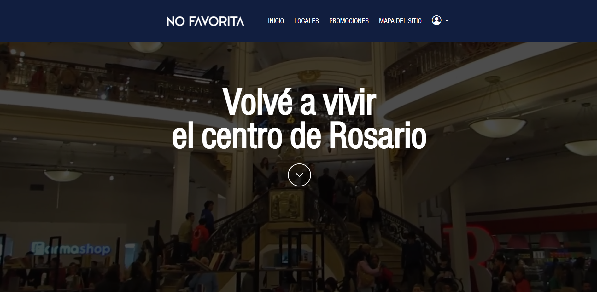
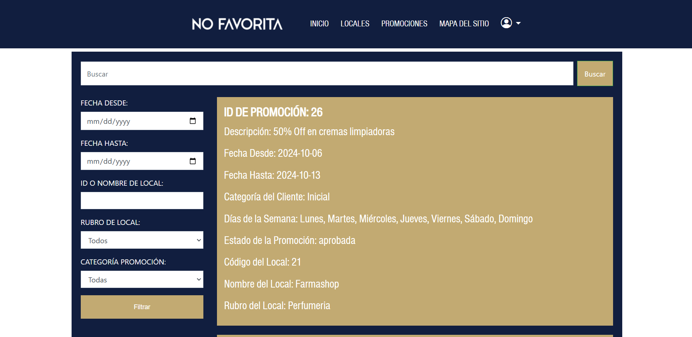
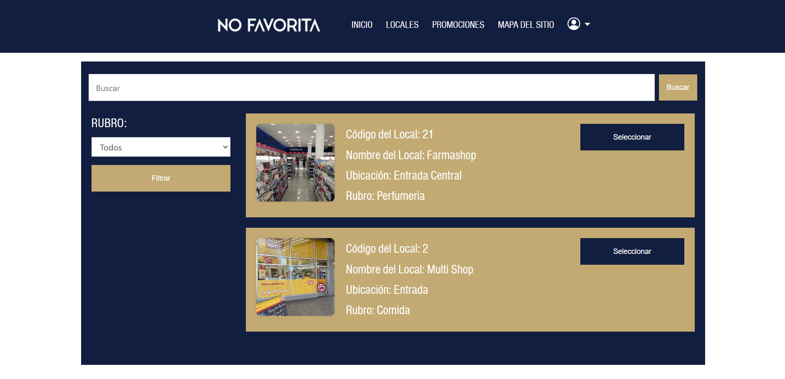

# no-favorita
Sitio Web: [nofavorita.social](https://www.nofavorita.social)

Página web diseñada para gestionar locales y promociones del renovado shopping de Rosario.

## Descripción del Proyecto

Este proyecto consiste en el desarrollo de una página web responsiva que permite la gestión completa de promociones, novedades, locales y usuarios en el shopping. Está pensado para facilitar la interacción entre clientes, dueños de locales y administradores del sistema, ofreciendo una experiencia fluida y accesible en múltiples dispositivos.

## Funcionalidades Principales

### Gestión de Usuarios y Autenticación

- **Validación de cuenta**: Implementada mediante el envío de un correo electrónico y validación con la base de datos utilizando métodos de encriptación y hashing.
- **Registro y gestión de cuentas**: Clientes y dueños de locales pueden registrarse en el sistema, con autorización de los administradores para los dueños de locales.
- **Categorías de clientes**: Los clientes se clasifican en categorías ('Inicial', 'Medium', 'Premium') que determinan las promociones a las que pueden acceder. La categoría cambia en función del uso de las promociones.

### Gestión de Promociones y Novedades

- **Creación y gestión de promociones**: Los dueños de locales pueden crear y eliminar promociones, que deben ser aprobadas por los administradores.
- **Atributos de promociones**: Incluyen rango de fechas, categoría de cliente, días de la semana en que la promoción es válida y descripción.
- **Novedades**: Los administradores pueden crear novedades dirigidas a distintas categorías de clientes, que expiran automáticamente tras un intervalo de tiempo.

### Servidores y Almacenamiento en la Nube

- **Heroku**: Utilizado para hostear el sitio web, elejido para evitar el uso de soluciones de hosting gratuito.
- **PostgreSQL**: Utilizado para almacenar datos de los locales, usuarios, promociones, novedades, y el uso de las promociones por parte de los usuarios.
- **Cloudinary**: Utilización de su API para almacenar imágenes y datos de nuevos locales (Blob Storage).

### Reportes y Monitoreo

- **Reportes gerenciales**: Los administradores pueden monitorear el uso de descuentos mediante reportes generados por el sistema.
- **Monitoreo por dueños de locales**: Pueden ver la cantidad de clientes que usaron sus promociones.
- **Historial de promociones**: Los usuarios pueden ver el historial de promociones usadas.

## Tipos de Usuarios

La página cuenta con cuatro tipos de usuarios:

1. **Clientes**: Pueden registrarse, consultar y acceder a promociones.
2. **Dueños de Locales**: Gestionan las promociones de sus locales.
3. **Administradores**: Administran locales, promociones y usuarios.
4. **Usuarios no Registrados**: Pueden visualizar promociones y novedades.

## Tecnologías Utilizadas

- **Frontend**: HTML, CSS, PHP, Bootstrap
- **Backend**: PHP
- **Base de Datos**: PostgreSQL
- **Almacenamiento en la Nube**: Heroku, Cloudinary

## Habilidades Desarrolladas

Durante el desarrollo de este proyecto, hemos adquirido y fortalecido las siguientes habilidades:

- **Desarrollo Frontend**: Creación de interfaces de usuario responsivas y accesibles utilizando HTML, CSS y PHP.
- **Desarrollo Backend**: Implementación de un servidor con PHP, gestión de rutas y controladores.
- **Bases de Datos**: Diseño y gestión de bases de datos utilizando MySQL y PostgreSQL.
- **Almacenamiento en la Nube**: Integración y uso de servicios de almacenamiento en la nube con Heroku y Cloudinary.
- **Autenticación y Seguridad**: Implementación de autenticación de usuarios y validacion de cuenta con encriptación de contraseñas.
- **Gestión de Proyectos**: Organización y planificación del desarrollo del proyecto, implementación de buenas prácticas y metodologías ágiles.

## Capturas

---

---

---
## Para más, visitá el sitio: [nofavorita.social](https://www.nofavorita.social)